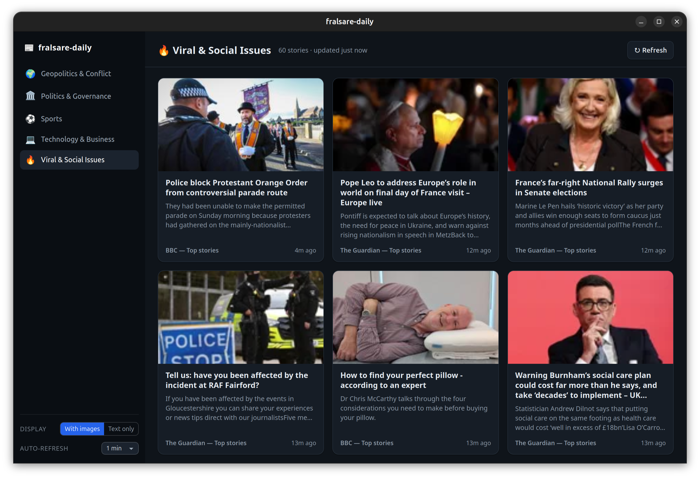

<p align="center">
  
</p>

# fralsare-daily

A fast, lightweight desktop news reader for Windows and Linux.

fralsare-daily aggregates headlines from public RSS feeds across five fixed
topics, so you get a clean, organized daily briefing without accounts, API
keys, or tracking. Clicking a story opens it in a built-in in-app reader —
you never leave the window.



## Topics

| Topic | What you'll get |
| --- | --- |
| Geopolitics & Conflict | World news and international affairs |
| Politics & Governance | Domestic politics and government |
| Sports | Match results, scores, and highlights |
| Technology & Business | Tech, startups, and markets |
| Viral & Social Issues | Trending stories and community highlights |

## Features

- **Standalone native window** — built with [Tauri 2](https://tauri.app),
  ~10–20 MB installer, no bundled Chromium
- **Images or text-only** — toggle the display mode; preference is remembered
- **Automatic refresh** — optional 1/5/15/30-minute intervals
- **Fast parallel loading** — 15 feeds fetched concurrently in Rust
- **In-app article reader** — stories open inside the window with a back
  button; an “Open in browser” button is always available as a fallback
- **In-app navigation** — links inside an article also open in the reader
- **No accounts, no keys** — everything runs on public RSS feeds

## Downloads

Prebuilt binaries for Windows and Linux live on the
[releases page](https://github.com/fralsare/fralsare-daily/releases):

- **Windows:** NSIS installer, MSI, or a portable `.exe` (no install —
  double-click to run)
- **Linux:** AppImage, `.deb`, or `.rpm`

## Building from source

### Prerequisites

- [Rust](https://rustup.rs) (stable)
- [Node.js](https://nodejs.org) 20+
- Platform dependencies:
  - **Linux**: `libwebkit2gtk-4.1-dev libxdo-dev build-essential libssl-dev
    libgtk-3-dev libayatana-appindicator3-dev librsvg2-dev`
  - **Windows**: Microsoft C++ Build Tools and WebView2 (preinstalled on
    Windows 10/11)

### Develop

```sh
npm install
npm run tauri dev
```

### Release binaries

```sh
npm install
npm run tauri build
```

Binaries land in `src-tauri/target/release/bundle/`.

## Architecture

```
┌─────────────────────────────────────────────┐
│  Frontend (TypeScript + Vite, no framework) │
│  sidebar · article cards · image/text toggle│
└──────────────────┬──────────────────────────┘
                   │ Tauri commands: fetch_topic, fetch_article
┌──────────────────▼──────────────────────────┐
│  Backend (Rust)                             │
│  feeds.rs    — 15 RSS sources, 5 topics     │
│  rss.rs      — streaming RSS 2.0/Atom parser│
│  sanitize.rs — article HTML sanitizer       │
│  lib.rs      — parallel fetch, 5-min cache  │
└─────────────────────────────────────────────┘
```
Feeds are fetched in the Rust backend, which sidesteps browser CORS
restrictions. A per-topic in-memory cache (5-minute TTL) avoids hammering
sources during quick navigation.

When you open a story, `fetch_article` downloads the page and sanitizes it
(two independent passes — a regex-based Rust sanitizer plus a DOM-based pass
in the frontend) that strip scripts, iframes, inline event handlers, and
`javascript:` URLs before anything is rendered. If a page can't be fetched
or isn't HTML, the reader shows the error with an “Open in browser”
fallback.

## Adding or changing feeds

Edit `src-tauri/src/feeds.rs` — each topic maps to a list of
`(name, url)` feed pairs. RSS 2.0 and Atom are both supported.

## 🙏 Support This Project

Developing, maintaining, and improving open-source tools takes time. If
you find it useful, consider supporting the work — the funds go towards my
**CyberSecurity studies**.

Support via **Razorpay** using either link:

- [razorpay.me/@fralsare](https://razorpay.me/@fralsare) — Quick payment link
- [rzp.io/rzp/TdksERz](https://rzp.io/rzp/TdksERz) — Payment page link

Thanks to all my backers for making this possible!

## License

MIT — see [LICENSE](LICENSE).
